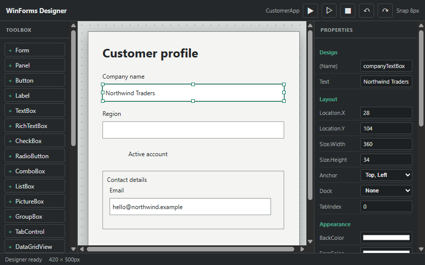
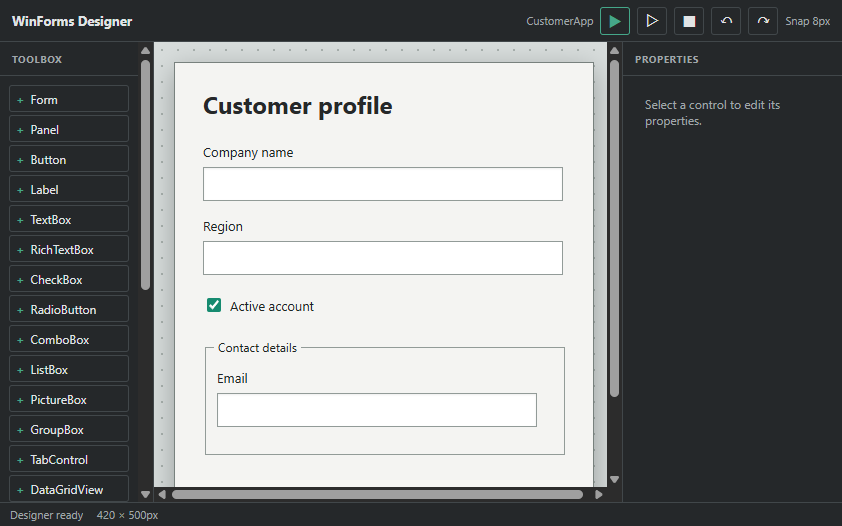
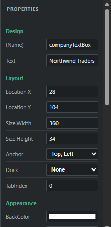

# WinForms Visual Designer for VS Code

**A visual designer for Windows Forms projects in VS Code Desktop.** Edit the C# designer model, inspect a live HTML preview, and launch the real WinForms application in its own native window.

<div align="center">
	<strong><a href="#português">Português</a></strong> &nbsp; | &nbsp; <a href="#english">English</a>
</div>

## Português

### Visão geral

O WinForms Visual Designer adiciona uma superfície visual a projetos Windows Forms em C#. Ele lê o arquivo `.Designer.cs` com Roslyn, apresenta controles em uma Toolbox e mantém o modelo visual sincronizado com o código.







### Funcionalidades

- Toolbox: Form, Panel, Button, Label, TextBox, RichTextBox, CheckBox, RadioButton, ComboBox, ListBox, PictureBox, GroupBox, TabControl e DataGridView.
- Arraste controles para o Form; Panel, GroupBox e TabControl também aceitam controles filhos.
- Selecione um ou vários controles; use oito alças para redimensionar e guias para alinhar.
- Snap-to-grid de 8 px, árvore de controles e painel de propriedades.
- Edição de Name, Text, Location, Size, Anchor, Dock, TabIndex, cores, fontes, estado Enabled/Visible/Checked, itens literais de ComboBox/ListBox e handlers de eventos comuns.
- Undo/redo, copiar, colar, duplicar e excluir controles.
- Preview HTML interativo e execução opcional do Form WinForms real em uma janela nativa separada.
- Sincronização Roslyn que substitui somente atribuições reconhecidas ou alteradas e preserva expressões C# que não consegue mapear.
- Proteção para mudanças externas no arquivo e buffers de layout não salvos; validação com `dotnet build`.
- Edição de controles existentes em layouts reconhecidos, incluindo `InitializeComponent()` e padrões procedurais suportados.
- Detecção de layouts em outros métodos C# quando controles são criados em variáveis locais com inicializadores e adicionados por `Controls.Add`; propriedades reconhecidas podem ser editadas diretamente no código original.

### Requisitos

- Windows e VS Code Desktop.
- .NET SDK 10 para executar o helper Roslyn e compilar a extensão. O aplicativo WinForms de destino precisa ter o SDK/runtime apropriado ao próprio projeto.
- Node.js e npm somente para desenvolver ou empacotar a extensão a partir do código-fonte.
- Projeto SDK-style com `UseWindowsForms=true`, ou Target Framework `*-windows` e tipos WinForms reconhecíveis no arquivo Designer.
- Um projeto SDK-style e um arquivo `.cs` com `InitializeComponent()` em bloco/expressão direta, ou com controles WinForms reconhecíveis em variáveis locais adicionados por `Controls.Add`. O layout pode estar no mesmo arquivo ou em arquivos parciais.
- Interfaces procedurais reconhecíveis permitem editar as propriedades mapeadas; código desconhecido é preservado e controles não mapeáveis não são expostos para edição.

### Instalação

1. Baixe `winforms-visual-designer-0.1.2.vsix` na página [Releases](https://github.com/salanthreedimension/WSFormsEditor/releases).
2. No VS Code, abra **Extensions** > `...` > **Install from VSIX...**.
3. Selecione o arquivo `.vsix` e recarregue a janela do VS Code quando solicitado.

Para desenvolver a extensão localmente, consulte a seção [Desenvolvimento](#desenvolvimento).

### Como usar

1. Abra no VS Code a pasta que contém o `.csproj` do projeto WinForms.
2. Confirme que o projeto é detectável: tenha `<UseWindowsForms>true</UseWindowsForms>` no `.csproj`, ou use um target como `net10.0-windows` e tipos WinForms no arquivo que contém o layout.
3. Abra o arquivo `.cs` do Form/UserControl ou seu `.Designer.cs` para iniciar o Designer. Sem arquivo Designer ou `InitializeComponent()`, o editor tenta reconhecer controles locais criados com `new` e adicionados com `Controls.Add`.
4. Clique no ícone **WinForms: Open Visual Designer** no título do editor ou execute esse comando pela Command Palette (`Ctrl+Shift+P`).
5. Use a Toolbox à esquerda para adicionar um controle. Arraste-o para posicionar; solte-o sobre Panel, GroupBox ou TabControl para aninhá-lo. Também é possível clicar no item para adicioná-lo ao Form.
6. Clique em um controle para selecioná-lo. Segure `Shift` para montar uma seleção múltipla. Arraste para mover; arraste uma das oito alças para redimensionar. O snap usa incrementos de 8 px e guias aparecem perto de alinhamentos.
7. Edite as propriedades à direita. As alterações são gravadas automaticamente no arquivo que contém o layout reconhecido; handlers de evento são métodos C# existentes ou que você criará no arquivo parcial do Form.
8. Use **Preview** para experimentar os equivalentes HTML. Use **Run Form** para compilar e abrir o aplicativo WinForms real; essa janela é nativa e separada do VS Code. **Stop** encerra o processo.
9. Se o arquivo de layout mudar em outro lugar, escolha **Reload** para descartar o modelo visual local ou **Save and overwrite** para salvar o buffer aberto e aplicar explicitamente o modelo do Designer.

O comando de execução exige que os arquivos C# abertos do projeto estejam salvos. Se a compilação falhar, os erros aparecem na barra de status; corrija-os no código e execute novamente.

### Atalhos e ações

| Ação | Tecla |
| --- | --- |
| Desfazer | `Ctrl+Z` |
| Refazer | `Ctrl+Y` ou `Ctrl+Shift+Z` |
| Copiar seleção | `Ctrl+C` |
| Colar | `Ctrl+V` |
| Duplicar seleção | `Ctrl+D` |
| Excluir seleção | `Delete` |
| Multi-seleção | `Shift` + clique ou arraste |

### Desenvolvimento

```powershell
npm install
npm test
dotnet build samples/WinFormsSample/WinFormsSample.csproj
npm run package
```

Para depurar, abra **Run and Debug** e inicie **Run WinForms Designer Extension**. Na janela Extension Development Host, abra `samples/WinFormsSample/Form1.cs` e execute o comando do Designer.

O teste de integração usa Roslyn para editar uma cópia temporária do sample e compilar o resultado. O projeto de exemplo também está disponível para teste manual em `samples/WinFormsSample/`.

### Arquitetura

| Diretório | Responsabilidade |
| --- | --- |
| `src/` | Extension Host, descoberta de projetos, WebviewPanel, detecção de conflito e build. |
| `media/` | UI do Webview, Toolbox, árvore, canvas, PropertyGrid, preview e histórico. |
| `roslyn/` | Análise e atualização de `InitializeComponent()` e de layouts procedurais reconhecidos usando `Microsoft.CodeAnalysis.CSharp`. |
| `tests/` | Testes de modelo e round-trip do helper Roslyn. |
| `samples/` | Projeto WinForms funcional para desenvolvimento e validação. |
| `docs/screenshots/` | Capturas do Webview usado no README. |

O Extension Host e o Webview comunicam-se por mensagens JSON. O modelo visual contém tipo, nome, propriedades, propriedades gerenciadas, eventos, localização, tamanho, pai e filhos. O helper trabalha sobre a árvore sintática Roslyn, não faz substituições por regex no código C#.

### Limites conhecidos

- O **Preview** é uma simulação HTML; ele não carrega nem executa o assembly WinForms. Para executar código e handlers reais, use **Run Form**, que abre uma janela nativa separada.
- O preview do DataGridView é ilustrativo. PictureBox aceita `ImageLocation` no modelo, mas o caminho de imagem não é resolvido no preview.
- ComboBox/ListBox editam coleções de strings literais; expressões com recursos, inicializadores ou lambdas que não possam ser mapeados são preservadas no código e não avaliadas visualmente.
- A Toolbox define os tipos criáveis no momento; os tipos WinForms ainda não catalogados são mantidos no arquivo e reportados como diagnósticos.
- Trechos procedurais ambíguos ou não reconhecidos não são expostos para edição e são preservados; se nenhum controle puder ser mapeado com segurança, o layout permanece somente leitura.
- Em layouts procedurais, a edição cobre controles reconhecidos em variáveis locais e propriedades mapeáveis. Inclusão/remoção não é oferecida; controles inline, factories e expressões ambíguas são preservados no código, mas não aparecem como controles editáveis.
- Os eventos são gravados como method groups. O método handler deve existir no código parcial do Form e ter uma assinatura compatível; o preview não executa o C# do handler.
- A validação exige um projeto WinForms compilável e o SDK .NET disponível no PATH.

## English

### Overview

WinForms Visual Designer adds a visual editing surface to C# Windows Forms projects in VS Code Desktop. It reads `.Designer.cs` with Roslyn, displays controls in a Toolbox, and synchronizes visual edits with the source model.


### Features

- Toolbox: Form, Panel, Button, Label, TextBox, RichTextBox, CheckBox, RadioButton, ComboBox, ListBox, PictureBox, GroupBox, TabControl, and DataGridView.
- Drag controls onto a Form; Panel, GroupBox, and TabControl can contain child controls.
- Single and multi-selection, eight resize handles, alignment guides, and 8 px snap-to-grid.
- Control tree and PropertyGrid.
- Edit Name, Text, Location, Size, Anchor, Dock, TabIndex, colors, fonts, Enabled/Visible/Checked state, literal ComboBox/ListBox items, and common event handlers.
- Undo/redo, copy, paste, duplicate, and delete.
- Interactive HTML preview and optional execution of the real WinForms Form in a separate native window.
- Roslyn updates only recognized or edited assignments and preserves C# expressions it cannot map.
- Protection against external file changes and dirty layout-file buffers; project validation through `dotnet build`.
- Existing controls can be edited in recognized layouts, including `InitializeComponent()` and supported procedural patterns.
- Layouts in other C# methods are detected when controls are created in local variables with object initializers and attached through `Controls.Add`; recognized properties can be edited in the original source.

### Requirements

- Windows and VS Code Desktop.
- .NET SDK 10 to run the Roslyn helper and build the extension. The target WinForms app also needs the SDK/runtime required by its own project.
- Node.js and npm only when developing or packaging the extension from source.
- An SDK-style project with `UseWindowsForms=true`, or a `*-windows` target framework and recognizable WinForms types in the paired Designer file.
- An SDK-style project and a `.cs` file with block/expression-bodied `InitializeComponent()`, or recognizable WinForms controls declared as local variables and attached with `Controls.Add`. Layout code may be in the same file or split across partial files.
- Procedural layouts with ambiguous construction patterns are shown read-only; recognized controls in supported patterns can still be edited without changing unsupported code.

### Install

1. Download `winforms-visual-designer-0.1.2.vsix` from the [Releases](https://github.com/salanthreedimension/WSFormsEditor/releases) page.
2. In VS Code, open **Extensions** > `...` > **Install from VSIX...**.
3. Select the `.vsix` file and reload VS Code when prompted.

To run the extension from source, see [Development](#development).

### Using the Designer

1. Open the folder containing your WinForms `.csproj` in VS Code.
2. Make sure the project can be detected: set `<UseWindowsForms>true</UseWindowsForms>` in the project, or use a target such as `net10.0-windows` with WinForms types in the file containing the layout.
3. Open the Form/UserControl `.cs` file or its `.Designer.cs` file to start the designer. Without a Designer file or `InitializeComponent()`, the extension tries to recognize local controls created with `new` and attached with `Controls.Add`.
4. Click **WinForms: Open Visual Designer** in the editor title, or run the command from the Command Palette (`Ctrl+Shift+P`).
5. Use the Toolbox on the left to add a control. Drag it to position it; drop it on a Panel, GroupBox, or TabControl to create a child. Clicking a Toolbox item adds it to the Form.
6. Click a control to select it. Hold `Shift` while clicking or dragging to build a multi-selection. Drag to move; drag any of the eight handles to resize. The grid snaps in 8 px increments and alignment guides appear near matching edges and centers.
7. Edit properties on the right. Changes are written automatically to the file containing the recognized layout code. Event bindings refer to C# methods that exist, or will be added, in the Form's partial code file.
8. Use **Preview** to try the HTML equivalents. Use **Run Form** to build and launch the real WinForms app; it opens in a separate native window. **Stop** terminates the process.
9. If the layout file changes elsewhere, choose **Reload** to discard the local visual model, or **Save and overwrite** to save the open editor buffer and explicitly apply the Designer model.

The Run command requires all open C# files in the project to be saved. Build errors appear in the status bar; fix them in source and run again.

### Shortcuts and Actions

| Action | Shortcut |
| --- | --- |
| Undo | `Ctrl+Z` |
| Redo | `Ctrl+Y` or `Ctrl+Shift+Z` |
| Copy selection | `Ctrl+C` |
| Paste | `Ctrl+V` |
| Duplicate selection | `Ctrl+D` |
| Delete selection | `Delete` |
| Multi-select | `Shift` + click or drag |

### Development

```powershell
npm install
npm test
dotnet build samples/WinFormsSample/WinFormsSample.csproj
npm run package
```

To debug, open **Run and Debug** and start **Run WinForms Designer Extension**. In the Extension Development Host, open `samples/WinFormsSample/Form1.cs` and run the designer command.

The integration test uses Roslyn to update a temporary copy of the sample and compile the generated project. The sample is also available for manual testing in `samples/WinFormsSample/`.

### Architecture

| Directory | Responsibility |
| --- | --- |
| `src/` | Extension Host, project discovery, WebviewPanel, conflict detection, and builds. |
| `media/` | Webview UI, Toolbox, tree, canvas, PropertyGrid, preview, and history. |
| `roslyn/` | `InitializeComponent()` and recognized procedural layout analysis/updates through `Microsoft.CodeAnalysis.CSharp`. |
| `tests/` | Model tests and Roslyn round-trip integration tests. |
| `samples/` | A working WinForms project for development and validation. |
| `docs/screenshots/` | Webview screenshots used in this README. |

The Extension Host and Webview communicate through JSON messages. The UI model stores control type, name, properties, managed properties, events, location, size, parent, and children. The helper operates on the Roslyn syntax tree rather than replacing C# with regular expressions.

### Known Limitations

- **Preview** is an HTML simulation; it does not load or execute the WinForms assembly. Use **Run Form** to execute real code and handlers in a separate native window.
- DataGridView preview content is illustrative. PictureBox stores `ImageLocation`, but local image paths are not resolved in the Webview preview.
- ComboBox/ListBox edit literal string collections. Resource expressions, complex initializers, and lambdas that cannot be mapped are preserved in code but not evaluated visually.
- The Toolbox defines which control types can currently be created. Existing WinForms types not yet cataloged are preserved and reported as diagnostics.
- Ambiguous or unrecognized procedural code is not exposed for editing and is preserved; if no controls can be mapped safely, the layout remains read-only.
- Procedural layouts support editing mapped properties of controls created in local variables and attached through `Controls.Add`. Adding/removing controls is disabled; inline/factory-created controls and ambiguous expressions are preserved in source but are not exposed as editable controls.
- Events are written as method groups. Their methods must exist in the Form's partial class with compatible signatures; preview does not execute C# handlers.
- Validation requires a buildable WinForms project and a .NET SDK available on PATH.
